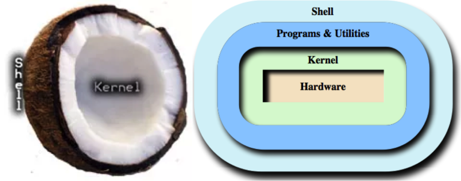
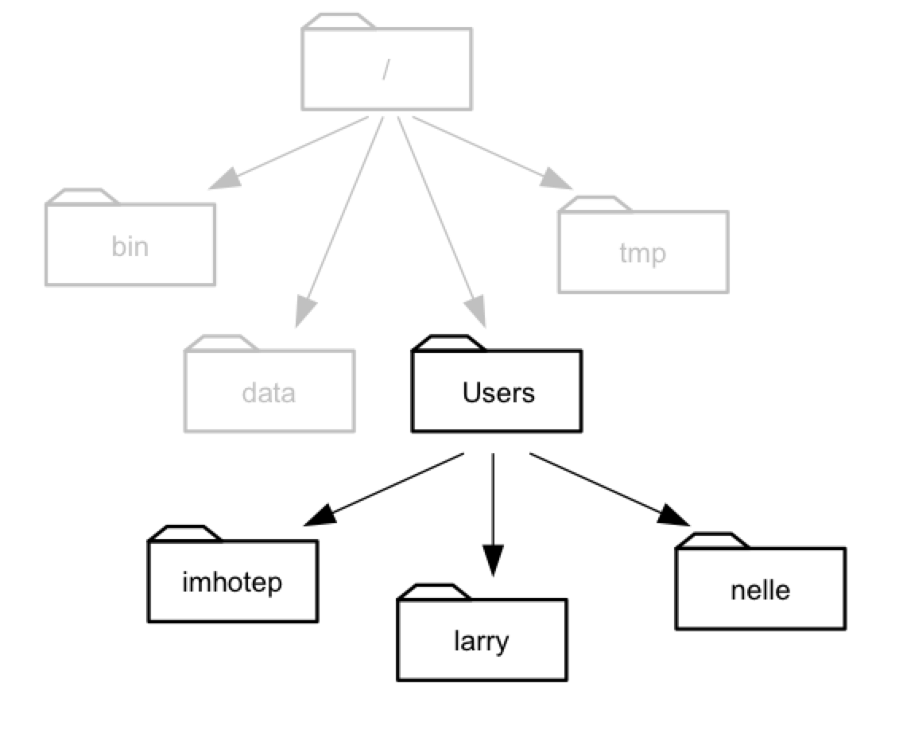

## Getting started

* Connect to felix or helix using NoMachine
We'll be conducting this course using a remote desktop utility called
[NoMachine](http://www.nomachine.com). You should have already met with the DSST
staff to configure and test it. Open the NoMachine App and connect to
felix.nimh.nih.gov if you are an NIMH employee or helix.nih.gov if you work for
another IC.
* Open Terminal from the Application-> System Tools menu
* We've setup a short script to get you started quickly in the NIH HPC (felix or helix). To run it, type:

~~~
source /data/DSST/scripts/repro_env_setup.sh
~~~
{: .bash}

* Start up an IPython window

~~~
jupyter qtconsole &
~~~
{: .bash}

Your screen should now look something like this:

## Know who (or what) you're talking to

It's easy and common to click on an icon, open and window and typing, clicking, and analyzing in that window without much thought about how or where those commands are being executed and where the data is being stored. It's worth the effort to take some time and understand exactly what your computing (stack)[] looks like and exactly where everything is happening. Understanding this stack can help you make your analysis more efficient and secure.

## Where am I?

The desktop you're looking at inside the NoMachine window is from a computer that lives over in building 13 at NIH's high performance computing (HPC) center. This computer (helix or felix) is separate from but closely affiliated with the large cluster of computers known as the Biowulf.

NoMachine is a remote desktop program. It allows your to interact with the remote computer (helix/felix) almost as if you were sitting right in front of it. (VNC is another common remote desktop program).

The window on the left of your NX desktop is running an IPython shell. On the right side, there is a window running a (Bash) shell. A (shell)[reference] refers to a program that wraps around another program that is usually more complicated and less user-friendly. That program inside the shell is often referred to as a kernel.

For any computer you might be working with, there is a main kernel that is part of the "operating system" at the heart of it.  On top of that kernel there are many other programs running, some of them are designed to provide you with an easy way to interact

# Boxed Text
Bash vs. IPython
We'll be working almost exclusively in the IPython shell in this course. IPython provides an easy way to explore and interact with your data that leverages the power of the Python programming language. The Bash shell is an extremely versatile tool designed to allow you to control and interact with files and your computer more generally. You've likely had exposure to Bash (or it's close cousin, tcsh) if you've used analysis packages like AFNI, FSL, and FreeSurfer. The Bash shell is a (great thing to learn)[Link to bash tutorials], but we want to focus on teaching you reproducible computing concepts without getting bogged down in the syntax of too many different languages.

# Exercise

Draw a diagram to illustrate how the programs and computers listed below relate to one another.

* Your laptop
* Helix & Felix
* The Biowulf cluster
* NoMachine Remote Desktop
* IPython Shell
* Angry Birds on your phone

No get with your partner and compare your drawings. Discuss the difference and edit as needed.

##  The file system
Talk about what a path is etc. using the following figures:

# Exercise

Use the cd command to change to each of these directories in this order:

In each directory, run the following command to create a simple csv text file

echo $PWD,$USER, Was Here, $TIME > $USER_footprint.csv

When you're finished, list your footprint files:
find . -name $USER -exec cat {} \;

Copy the output into the Etherpad

## The Jupyter qtconsole

> ## A note on the IPython prompt
>
> ~~~
>  In [1]
> ~~~
> {: .source}
> The IPython prompt, as depicted above, sits before our blinking cursor. It
> consists of the word "In" followed by a number. It informs us that we are
> currently entering input. In this case the first input of the Ipython kernel
> session. Every time we execute a command this number will increment by one.
 {: .callout}

The Jupyter qtconsole is a developing environment that is optimised for
interactive computing typical of scientific analyses. It provides lots of
convenient commands and shortcuts for this. Different languages can used with
this interface. In our case we will be using Ipython. It provides us with  a
convenient interface to the system shell and the Python interpreter. We will
start by typing in the IPython command:
~~~
%pwd
~~~
{: .source}
~~~
/Users/this_user
~~~
{: .output}

This returns the present working directory, the file-system-context
for the commands that we execute. We can refer to these files by simply typing
their names. We can list these files by using the next command:
~~~
%ls
~~~
{: .source}

The `'%ls` command returns all the files in the present working directory. When
we wish to perform actions on these files we can refer to them directly by their
names and the shell will understand which files we are referring to. Later we
 will talk about how to add new files to the current directory but for now we
 will use the `%mkdir` command to add a directory into our present working
 directory:

~~~
%mkdir reproducibility_course
~~~
{: .source}

## IPython magics and system commands

The above commands can be entered into the Ipython in slightly different ways.
Instead of using the "%" sign we can instead use the "!" sign and we will still
get the same results (although we will not be able to make the same directory
again).

~~~
!pwd
!ls
!mkdir reproducibility_course
~~~
{: .source}
~~~
/Users/this_user
... A list of files in the current directory...
mkdir: cannot create directory `reproducibility_course': File exists
~~~
{: .output}

When we use the "%" sign it denotes that the command is an IPython magic. These
are special commands available in IPython that make doing some common tasks
easier on the command line. The "!" instead sends the command to the system
shell. On a Linux or Mac OSX operating system this will likely be the Bash
shell. All of these commands exist in Bash; however, on a Windows operating
system the pwd system command does not exist. You can see we have to be careful
about using system commands. Some will be operating system dependent. Since the
Ipython magics will work regardless of the operating system used, we shall
instead use those when we can.

## System commands start a new sub-process
Apart from the different system commands across platforms there is another
reason we might have a preference for Ipython magics. Each system command starts
up a sub-process, executes the commands, and then closes. The effect of this can
be seen very easily when we use the "!cd" system command to change directories.

~~~
%pwd
!cd reproducibility_course
%pwd
~~~
{: .source}
~~~
/Users/this_user
!cd reproducibility_course
/Users/this_user/reproducibility_course
~~~
{: .output}

This woud not be the behaviour we would wish from a command that changes our
present working directory. This occurs because the changes made to the
environment in the sub-process are not propagated back to the Ipython shell. If
we use the Ipython magic `%cd` we get the behaviour we want
~~~
%pwd
%cd reproducibility_course
%pwd
~~~
{: .source}
~~~
/Users/this_user
!cd reproducibility_course
/Users/this_user/reproducibility_course
~~~
{: .output}

*  As we work through the course we will continue to learn some convenient
shortcuts available to use in the Ipython shall; however, most of the time we
will be writing commands that are in the Python language.

## Convenient commands to remember

*   Use tab completion when possible. The computer is more precise than we are.
*   We can cycle through previous commands using up and down arrows.
*   We can cycle through previous commands starting with the current text using
Ctl + n/p
*   Enter,  Ctl + Enter / Shift + Enter allow us to run commands in different
ways
